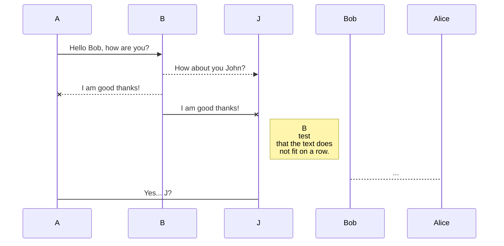
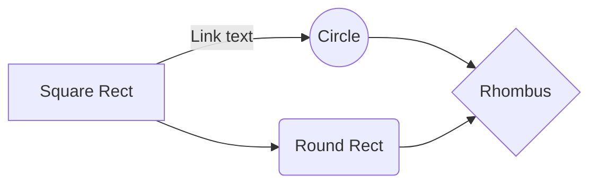

# SharePoint Framework Extensions - SPFx

This application covers one important concept in SharePoint Framework Development known as SharePoint Framework Extensions.

 - SharePoint Application Customizer 
 - SharePoint Command Sets 
 - SharePoint Field Customizer

#  Building the code

Some of the examples required you to have a SharePoint list already available in your environment. I'll let you know when you'll need it. Please clone the repository and navigate to the SPFx extension directory you want to work with.

    git clone the repo

Inside of each repository, you can run by using the terminal, the following code:

    npm i
	npm i -g gulp // in case you don't have gulp install. 
	gulp

Each package produces the following:

-   lib/* - intermediate-stage commonjs build artifacts
-   dist/* - the bundled script, along with other resources
-   deploy/* - all resources which should be uploaded to a CDN.

##  Build options

	-gulp clean - TODO 
	-gulp test - TODO 
	-gulp serve - TODO 
	-gulp bundle - TODO 
	-gulp package-solution - TODO

## UML diagrams

The main diagram of the application :

And this will produce a flow chart:

